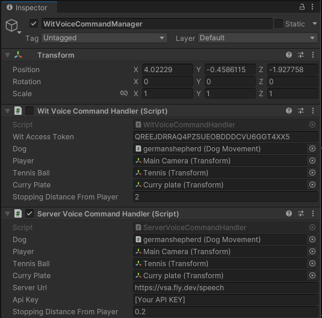

# Server-Based Voice Command Handling

This folder contains the Unity client implementation for handling voice commands by calling the server at `vsa.fly.dev`.

## 📦 Installation

1. Copy the `ServerVoiceCommandHandler.cs` script from the `Scripts` folder into your Unity project's `Assets` folder.

## 🚀 Usage

1. In your Unity scene, attach the `ServerVoiceCommandHandler` script to a GameObject.
2. Configure the script in the Inspector:

   - **Server Url**: Set to `https://vsa.fly.dev/speech`
   - **Api Key**: Enter your API key.

3. The client will send audio data to the server, which processes it using Wit.ai, intent analysis, LLM response generation, and TTS synthesis.

## 🖼️ Unity Inspector Setup

- In the Unity Editor, select the `WitVoiceCommandManager` GameObject.
- Add the `ServerVoiceCommandHandler` component to this GameObject.
- **Uncheck (disable) the old `WitVoiceCommandHandler` component** to avoid conflicts.
- Assign the required objects (Dog, Player, Tennis Ball, Curry Plate, etc.) in the Inspector.

Below is an example of how your GameObject should look in the Unity Inspector:

## 📝 Key Features

- Voice command recognition
- TTS response playback
- Mode switching (pet, math_game, chat)
- Per-user memory

## 🐛 Troubleshooting

- Ensure your API key and server URL are set correctly.
- Check the Unity console for any errors during processing.
